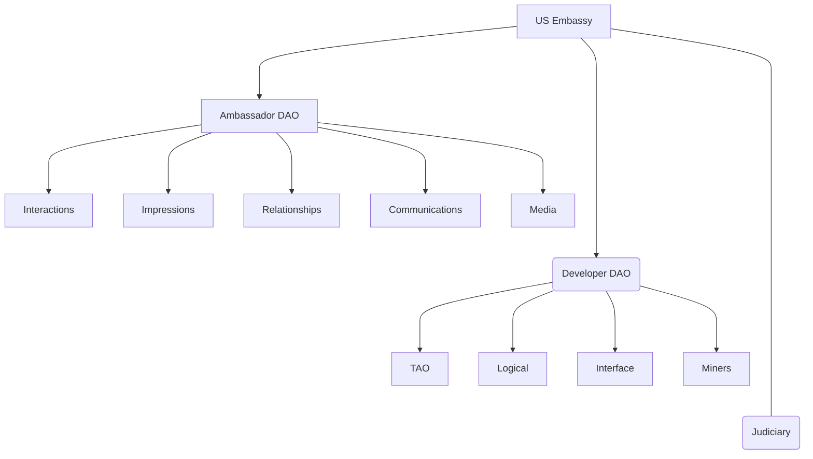

# DAO Organization Chart
The DAO is made up of the US Embassy which is a non-profit organiation and under it there are three branches Ambassdors, Developers and Judicairy. 

&nbsp;

```mermaid
flowchart TD
    A[US Embassy]
    A--->B[Ambassador DAO];
    A------>C(Developer DAO);
    A----------D(Judiciary);
    B--->E[Interactions]
    B--->F[Impressions]
    B--->G[Relationships]
    B--->H[Communications]
    B--->I[Media]
    C--->J[TAO]
    C--->K[Logical]
    C--->L[Interface]
    C--->M[Miners]
```
