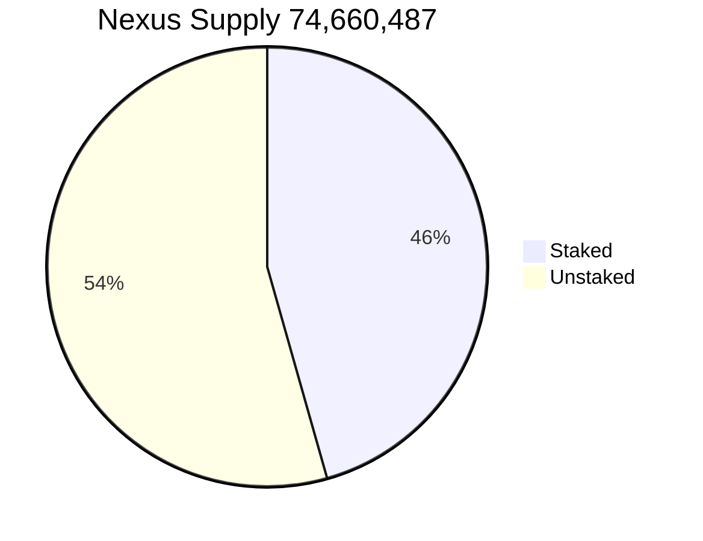

# Economics

* ***Current Supply*: 74,660,487 (4th November, 2022)**
* ***Target Supply @ 2024*: 78,000,000 NXS**
* ***Current Inflation*: 0.487% (4th November, 2022)**

## Nexus Minting

The first Nexus block was mined on September 23rd, 2014 at 16:20:00 GMT – 7. As of November 4th, 2022, the total supply of NXS is 74,660,487, which is 95.71% of the September 2024 target of 78,000,000.

The issuance of NXS is independent of a central bank or government, it has zero debt or interest associated with its distribution, and its supply is regulated by mathematics. This is in direct contrast to the creation of new loans of fiat currency by ‘Fractional Reserve Banking’, which people are required to pay back to a bank.

The process of creating NXS requires mining (similar to that of Bitcoin) or staking, which gives a base value to the currency backed by the physical resources required to create each individual coin. Both miners and stakers contribute real resources or equity to the Nexus ecosystem, such as energy, hardware, and time. In return, they receive newly created NXS. Defining the rewards to miners and stakers is very important. Too low and rewards are not significant enough to encourage nodes to mine and stake. Too high and the growth in supply could erode the value of the currency over time.

## **Annual Inflation:**

\
As of September 30th, 2022, the current inflation rate for NXS is 0.4822%.

After September 2024, both Proof-of-Work channels combined will increase the supply by a maximum of 1 NXS per minute, resulting in the creation of 525,000 NXS per year or a maximum of 0.67% inflation per annum. The growth in supply of NXS from the Proof-of-Stake channel will be capped at a maximum of 3.00% per annum. This makes the post 2024 inflation a maximum of 3.67% that can only be realized if the entire NXS supply were staked at the maximum stake rate. Currently, it takes one year of consistent staking to build up enough Trust to earn a 3.00% rate of return.

This model is designed to produce an annual growth rate in the supply of a NXS similar to the annual growth rate of the total world supply of gold. Gold is an asset which has often been favoured in times of economic crisis as a hedge against the inflation of fiat currencies, due to the scarcity of its supply and difficulty to increase it.

## **Adjustable Rewards:**

\
Unlike Bitcoin, where all miners eventually have to rely on a price-rise to keep mining viable, Nexus (NXS) rewards both miners for mining blocks and stakers for holding NXS; all rewards coming from freshly minted coins.

Nexus adjusts the reward with every block. Using an equation for exponential decay, exp(-kt), where k is a carefully chosen constant, a deposit is made into the global reserves (a decentralized supply management system) every minute. The reserve determines the available reward for miners which is locked to time and not the block production rate. This allows the projected supply to be even more accurately calculated at any second past the network time-lock.
